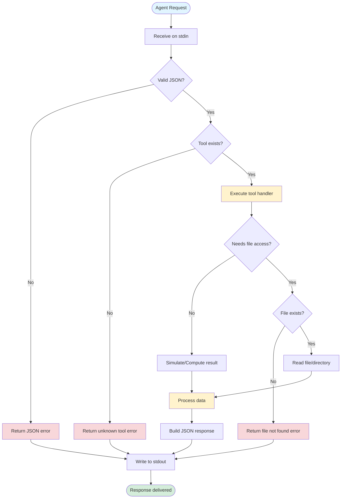

# KryptoTrac MCP Server - Architecture

## Overview

The KryptoTrac MCP (Model Context Protocol) Server is a lightweight, standalone Node.js server that provides GitHub Copilot Agents with specialized tools for interacting with the KryptoTrac application. This document details the technical architecture, data flows, and system design.

## System Architecture

### High-Level System Overview


### Component Responsibilities

| Component | Responsibility | Technology |
|-----------|---------------|------------|
| **Copilot Agent** | Initiates tool requests, processes responses | GitHub Copilot Runtime |
| **stdin/stdout Handler** | Manages I/O streams for IPC | Node.js streams |
| **Request Parser** | Parses and validates JSON requests | Native JSON.parse |
| **Tool Router** | Directs requests to appropriate tool handlers | Switch statement |
| **Tool Handlers** | Execute tool logic and return results | Async functions |
| **File System** | Source of truth for application data | Node.js fs module |

## Tool Invocation Flow

### Sequence Diagram: Complete Request-Response Cycle


### Request Flow Steps

1. **Initialization**
   - MCP server starts via `node scripts/kryptotrac-mcp.js`
   - Emits startup signal with available tools
   - Begins listening on stdin

2. **Request Reception**
   - Agent writes JSON to server's stdin
   - Server's data event handler captures input
   - Input is trimmed and validated

3. **Parsing & Validation**
   - JSON.parse() attempts to parse request
   - Validates presence of `tool` property
   - Returns error if invalid

4. **Routing**
   - Switch statement matches tool name
   - Routes to appropriate async handler function
   - Returns error for unknown tools

5. **Tool Execution**
   - Tool handler performs its operation
   - May interact with filesystem
   - Builds response object

6. **Response Delivery**
   - Response object serialized to JSON
   - Written to stdout with newline
   - Agent receives and processes response

7. **Cleanup**
   - On exit, server emits exit signal
   - Resources cleaned up automatically

## Internal File System Layout

### KryptoTrac Project Structure


### Tool to Filesystem Mapping


## Data Flow Architecture

### Tool Execution Data Flow



## Communication Protocol

### JSON Message Format

#### Request Schema
```json
{
  "tool": "string (required)"
}
```

#### Response Schema (Success)
```json
{
  "tool": "string",
  "ok": true,
  "...": "tool-specific fields"
}
```

#### Response Schema (Error)
```json
{
  "error": "string",
  "detail": "string (optional)"
}
```

### Message Flow States


## Security Architecture

### Security Layers


### Security Constraints

1. **No Command Execution**: Server never executes shell commands
2. **Path Restrictions**: Only accesses specific whitelisted paths
3. **Read-Only**: All filesystem operations are read-only
4. **No Network**: No external network connections
5. **JSON-Only**: All I/O is JSON-serialized, preventing injection
6. **Process Isolation**: Runs in its own process space

## Performance Characteristics

### Resource Usage

| Metric | Value | Notes |
|--------|-------|-------|
| **Startup Time** | < 50ms | Node.js process initialization |
| **Memory Footprint** | ~10-20 MB | No external dependencies |
| **Response Time** | 10-100ms | Varies by tool and file size |
| **CPU Usage** | Minimal | I/O bound operations |
| **Concurrency** | Single-threaded | One request at a time via stdin |

### Scalability Considerations


## Deployment Architecture

### Development Environment


### CI/CD Environment


## Extension Points

### Adding New Tools


### Integration Points

1. **Tool Router** (`switch` statement in main file)
2. **Tool List** (startup signal)
3. **Documentation** (docs/mcp/tools/)
4. **Tests** (tests/mcp/)
5. **CI Validation** (.github/workflows/)

## Technology Stack

### Core Technologies


### Dependencies

- **Runtime**: Node.js (no version constraint, v14+ recommended)
- **External Packages**: None (fully self-contained)
- **OS**: Cross-platform (Linux, macOS, Windows)

## Future Architecture Enhancements

### Potential Improvements

1. **HTTP Server Mode**: Alternative to stdin/stdout
2. **Tool Plugins**: Dynamic tool loading system
3. **Authentication**: Token-based tool access
4. **Caching**: Response caching for expensive operations
5. **Async Tools**: Support for long-running operations
6. **Streaming**: Stream large files instead of reading entirely

### Migration Path


---

## Related Documentation

- [Tool Index](./index.md) - List of all available tools
- [Getting Started](./getting-started.md) - How to run the MCP server
- [README](./README.md) - Main documentation and troubleshooting

---

**Document Version**: 1.0.0  
**Last Updated**: November 15, 2025  
**Maintainer**: KryptoTrac Development Team
